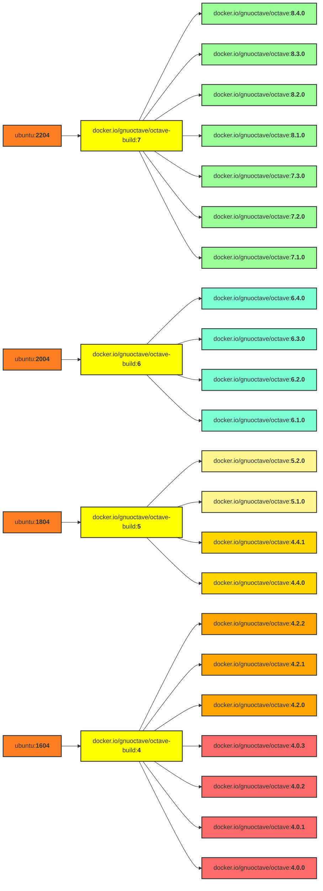

# Docker images of GNU Octave

> - DockerHub: https://hub.docker.com/r/gnuoctave/octave
> - GitHub: https://github.com/gnu-octave/docker

The Octave images can be run by
- [Docker](https://www.docker.com/):
  ```sh
  # Obtain image

  docker pull docker.io/gnuoctave/octave:8.4.0

  # Start container (command-line interface)

  docker run -it --rm gnuoctave/octave:8.4.0 octave
  ```
- [Podman](https://podman.io/): as before, replace `docker` with `podman`.
- [Singularity](https://sylabs.io/singularity/): most recommended for GUI mode.
  ```sh
  singularity pull docker://gnuoctave/octave:8.4.0

  # Start container (command-line interface)

  singularity run octave_8.4.0.sif
  ```

See below for starting Octave with GUI.


## Easy installation

An installation script is provided,
that can be called directly with this shell command:
```bash
/bin/bash -c "$(curl -fsSL https://raw.githubusercontent.com/gnu-octave/docker/main/install.sh)" -t docker
```
To remove the installation, type:
```bash
/bin/bash -c "$(curl -fsSL https://raw.githubusercontent.com/gnu-octave/docker/main/install.sh)" -u -f
```
It creates links in `$HOME/bin`,
as well as a Desktop entry,
to start the Octave as if it was installed by the Linux distribution.

**Note:** The system must have either Docker (= Podman) or Singularity
installed and the user account must be setup to use those tools properly.
Please adapt the shell command after `-t` respectively.


## Starting the Octave GUI

Using Singularity, start Octave with GUI with this command:
```
singularity exec --bind /run/user octave_8.4.0.sif octave --gui
```

Using Docker or Podman run:
```sh
docker run \
  --rm \
  --network=host \
  --env="DISPLAY" \
  --env="HOME=$HOME" \
  --env="XDG_RUNTIME_DIR=$XDG_RUNTIME_DIR" \
  --user $(id -u):$(id -g) \
  --volume="$HOME:$HOME:rw" \
  --volume="/dev:/dev:rw" \
  --volume="/run/user:/run/user:rw" \
  --workdir="$HOME" \
  docker.io/gnuoctave/octave:8.4.0 octave --gui
```

For old Octave 4.x.x versions you might additionally pass the
`--env=QT_GRAPHICSSYSTEM=native` environment variable.

> **Note:** The best experience was made with Singularity and Docker.
> Podman had several flaws when run as unprivileged (non-root) user.

> **Note:** The "Easy installation" described above does a few tweaks
> to the `docker run` command to enable parallel usage of multiple Octave
> versions and `sudo`-support for the non-root user.

## Hierarchy of all available images




## Further reading

- <https://siko1056.github.io/blog/2021/06/10/octave-docker.html>
  A longer blog article about this project including descriptions how to use
  and customize these images for specific needs.
