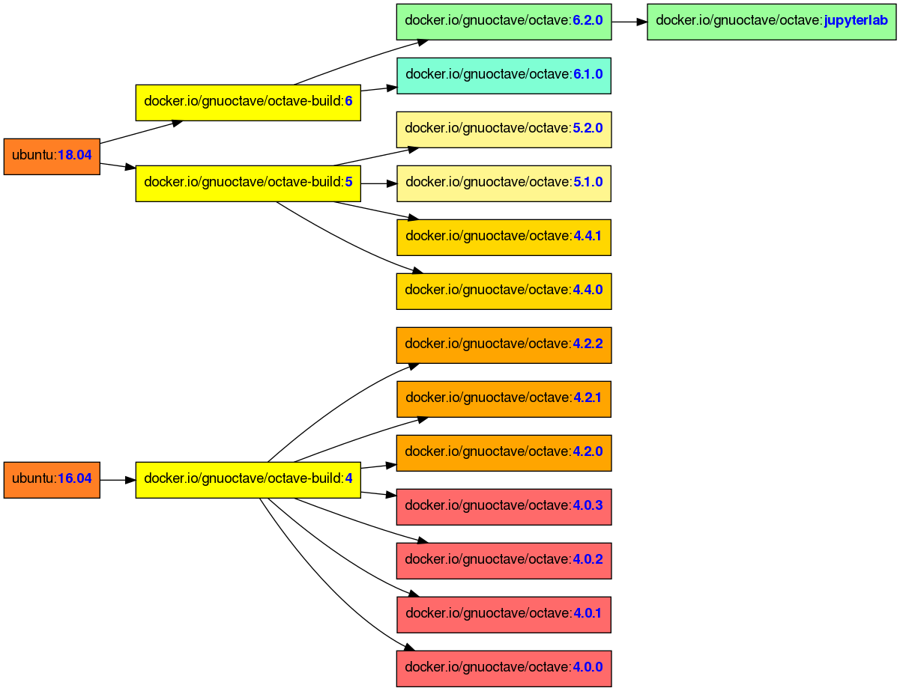

# Docker images of GNU Octave

> https://hub.docker.com/r/gnuoctave/octave

The Octave images can be run by
- [Docker](https://www.docker.com/):
  ```sh
  # Obtain image
  docker pull docker.io/gnuoctave/octave:6.2.0
  # Start container (command-line interface)
  docker run -it --rm gnuoctave/octave:6.2.0 octave
  ```
- [Podman](https://podman.io/): as before, replace `docker` with `podman`.
- [Singularity](https://sylabs.io/singularity/): most recommended for GUI mode.
  ```sh
  singularity pull docker://gnuoctave/octave:6.2.0
  # Start container (command-line interface)
  singularity run octave_6.2.0.sif
  ```

See below for starting Octave with GUI.


## Hierarchy of all available images




## Starting the Octave GUI

Using Singularity, start Octave with GUI with this command:
```
singularity exec --bind /run/user octave_6.2.0.sif octave --gui
```

Using Docker or Podman run:
```sh
docker run \
  --rm \
  --network=host \
  --env="DISPLAY" \
  --env="XDG_RUNTIME_DIR=$XDG_RUNTIME_DIR" \
  --env="NB_USER=$USER" \
  --env="NB_UID=$(id -u)" \
  --env="NB_GID=$(id -g)" \
  --env="GRANT_SUDO=yes" \
  --user root \
  --volume="$HOME:$HOME:rw" \
  --volume="/dev:/dev:rw" \
  --volume="/run/user:/run/user:rw" \
  docker.io/gnuoctave/octave:6.2.0 start.sh octave --gui
```

For old Octave 4.x.x versions you might additionally pass the
`--env=QT_GRAPHICSSYSTEM=native` environment variable.

> **Note:** The best experience was made with Singularity and Docker.
> Podman had several flaws when run as unprivileged (non-root) user.


## Further reading

- <https://siko1056.github.io/blog/2021/06/10/octave-docker.html>
  A longer blog article about this project including descriptions how to use
  and customize these images for specific needs.
